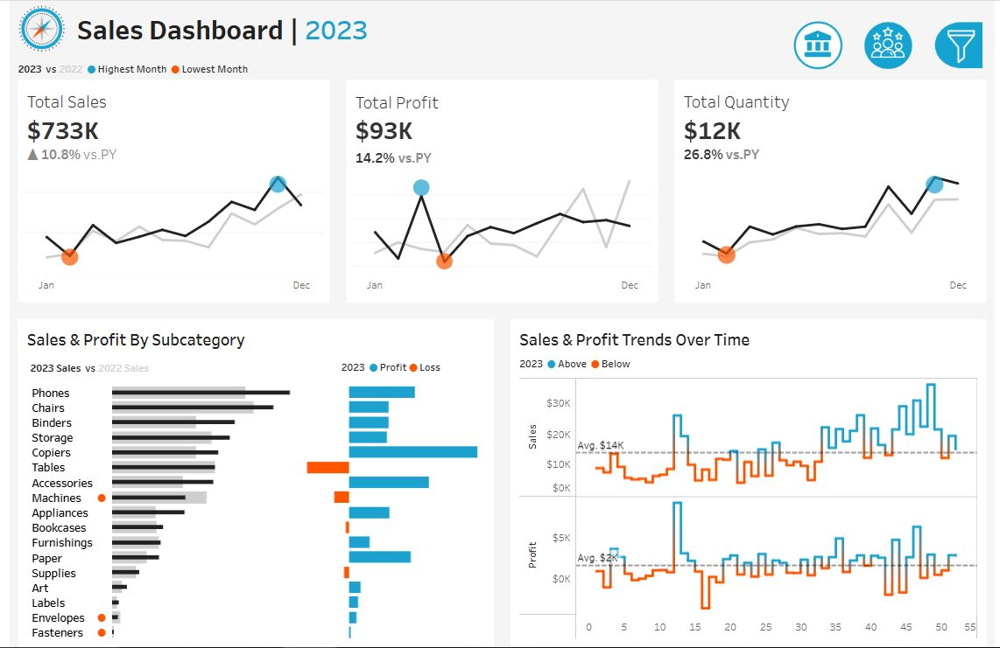
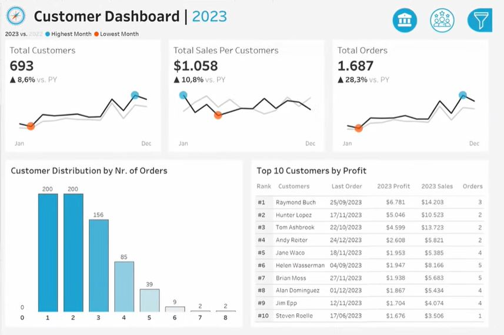

# 📊 Sales & Customer Analytics Dashboard

> An end-to-end Tableau business intelligence project delivering executive-level insights on sales performance, profitability, and customer behavior — powered by a relational multi-table dataset.

---

## 🖼️ Dashboard Previews

### Sales Dashboard


### Customer Dashboard


---

## 🎯 Project Overview

This project presents two interactive Tableau dashboards built on the classic **Sales and Customers** dataset — a multi-table relational model spanning customers, orders, products, and locations across the United States.

The dashboards are designed to answer real business questions that matter to executives, sales managers, and analysts:

- Which product subcategories drive the most profit — and which are bleeding losses?
- How is the business trending month over month vs. the prior year?
- Who are the highest-value customers, and how frequently do they order?
- Where are sales and profit above or below average over time?

---

## 📈 Dashboard 1 — Sales Performance

| KPI | 2023 Value | YoY Change |
|---|---|---|
| 💰 Total Sales | $733K | ▲ 10.8% vs. PY |
| 📦 Total Quantity | 12K units | ▲ 26.8% vs. PY |
| 💵 Total Profit | $93K | ▲ 14.2% vs. PY |

**Key Visuals:**

- **Monthly Sparklines** — Current year vs. prior year with highest/lowest month callouts
- **Sales & Profit by Subcategory** — Horizontal bar chart comparing 2023 vs. 2022 sales, paired with profit/loss indicators per subcategory (e.g., Tables & Machines are loss-makers; Phones & Chairs lead in sales)
- **Sales & Profit Trends Over Time** — Dual time-series chart with above/below average shading, benchmarked at Avg. $14K (Sales) and Avg. $2K (Profit)

---

## 👥 Dashboard 2 — Customer Intelligence

| KPI | 2023 Value | YoY Change |
|---|---|---|
| 🧑‍🤝‍🧑 Total Customers | 693 | ▲ 8.6% vs. PY |
| 🛒 Sales Per Customer | $1,058 | ▲ 10.8% vs. PY |
| 📋 Total Orders | 1,687 | ▲ 28.3% vs. PY |

**Key Visuals:**

- **Customer Distribution by Order Count** — Bar chart revealing that 400 customers placed only 1–2 orders, highlighting upsell opportunity
- **Top 10 Customers by Profit** — Ranked table with last order date, 2023 profit, 2023 sales, and order count (e.g., Raymond Buch: $6,781 profit on $14,203 sales)

---

## 🗃️ Data Model

The project uses a star-schema-style relational model with four tables joined on shared keys:

```
Orders.csv
├── Customer ID  ──→  Customers.csv  (Customer ID, Customer Name)
├── Postal Code  ──→  Location.csv   (Postal Code, City, State, Region, Country)
└── Product ID   ──→  Products.csv   (Product ID, Category, Sub-Category, Product Name)
```

| File | Description | Key Fields |
|---|---|---|
| `Orders.csv` | Fact table — one row per line item | Order ID, Order Date, Sales, Quantity, Discount, Profit |
| `Customers.csv` | Customer dimension | Customer ID, Customer Name |
| `Location.csv` | Geography dimension | Postal Code, City, State, Region |
| `Products.csv` | Product dimension | Product ID, Category, Sub-Category, Product Name |

---

## 🛠️ Tools & Skills Demonstrated

| Area | Details |
|---|---|
| **BI Tool** | Tableau Desktop |
| **Data Modeling** | Multi-table joins (star schema), calculated fields |
| **Visualization Types** | Sparklines, bar charts, time-series area charts, ranked tables, KPI cards |
| **Analysis Techniques** | Year-over-year comparison, above/below average benchmarking, profit/loss segmentation |
| **Design Principles** | Consistent color language (blue = positive, orange = negative/loss), clean layout, executive summary format |

---

## 🚀 How to Explore the Dashboard

1. **Clone this repository**
   ```bash
   git clone https://github.com/your-username/superstore-tableau-dashboard.git
   cd Sales and Customer-tableau-dashboard
   ```

2. **Open in Tableau Desktop**
   - Open `Superstore_Dashboard.twbx` in Tableau Desktop (v2022.1+)
   - All data is embedded — no additional setup required

3. **Or explore via Tableau Public**
   - 🔗 [View Live Dashboard on Tableau Public](#) *(https://public.tableau.com/app/profile/gayatri.jangam/viz/SalesDashboard_17756524567870/SalesDashboard?publish=yes)*

---

## 📁 Repository Structure

```
📦 Sales and Customer-tableau-dashboard
├── 📊 Sales and Customer_Dashboard.twbx    # Packaged Tableau workbook
├── 📄 Orders.csv                   # Fact table
├── 📄 Customers.csv                # Customer dimension
├── 📄 Location.csv                 # Geography dimension
├── 📄 Products.csv                 # Product dimension
├── 🖼️ sales.JPG                    # Sales dashboard preview
├── 🖼️ cus.JPG                      # Customer dashboard preview
└── 📝 README.md
```

---

## 💡 Key Business Insights

- **Tables are loss-making** despite significant sales volume — a clear signal for pricing or discount strategy review
- **400 of 693 customers** ordered only 1–2 times in 2023 — a major retention and repeat-purchase opportunity
- **Phones & Chairs** are the dual revenue engines by subcategory
- **Q4 (Nov–Dec)** consistently peaks across Sales, Profit, and Quantity — useful for inventory and campaign planning
- **Top 10 customers** contribute disproportionate profit — CRM prioritization is warranted

---

## 📬 Contact

**Prathamesh / [Your Name]**
- 📧 [Gmail](mailto:gayatrijangam6@gmail.com)
- 💼 [LinkedIn](www.linkedin.com/in/gayatri-mallaya-jangam-offcial)
- 🐙 [GitHub](https://github.com/Gayatri-1234)

---

> ⭐ If you found this project helpful or insightful, consider giving it a star — it helps others discover it!
